# environment_ucb

A Flutter app with Spring Boot as backend that allows professors to reserve a classroom for extra classes. Classroom assignment is automatic, and professors only need to indicate which environment they want to reserve. Additionally, professors can register their entrance by scanning a QR code located in the assigned classroom. If professors have any concerns about the reservation, they can take pictures of the classroom and submit a claim.

Furthermore, an administrator can accept or decline a reservation and also address any claims by providing a response and reviewing the professor's claim.

## Spring Boot Backend Repository
[Spring Boot Backend](https://github.com/SebastianBelmonte01/environment_ucb_backend)

## Login
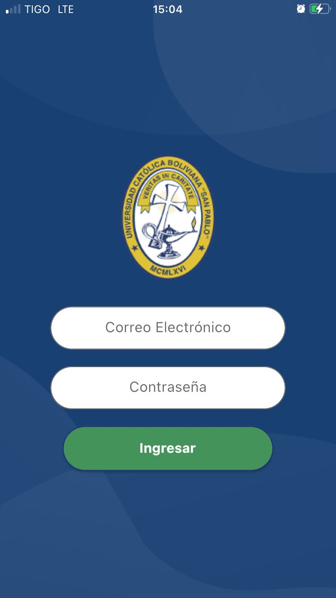
## Loading Screen
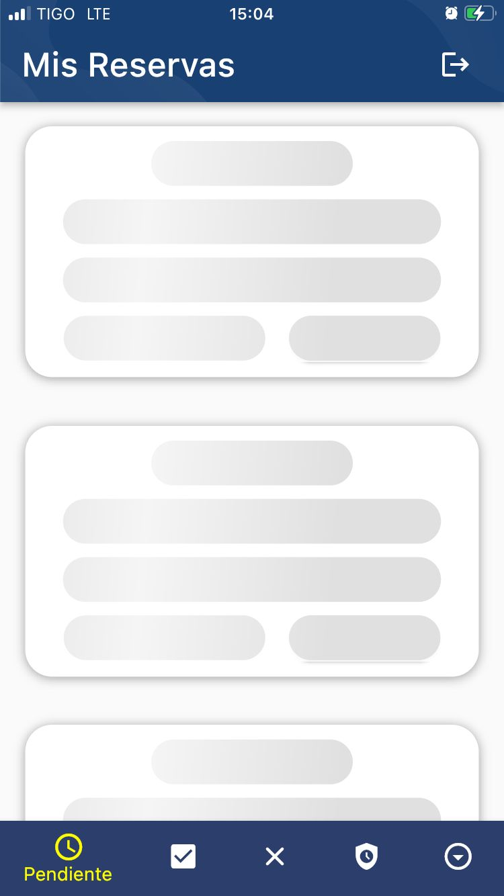

## Professor Screens

### Initial Screen
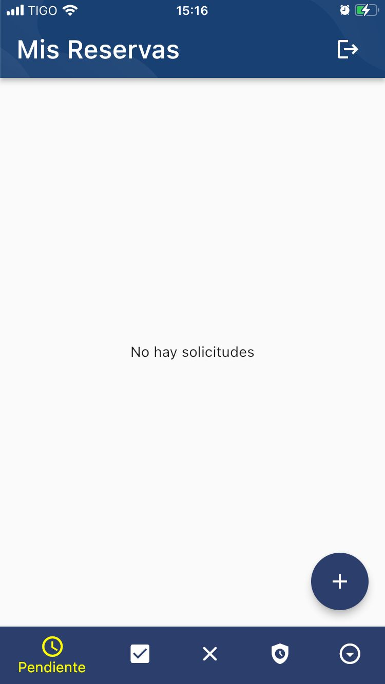
### Register a New Request
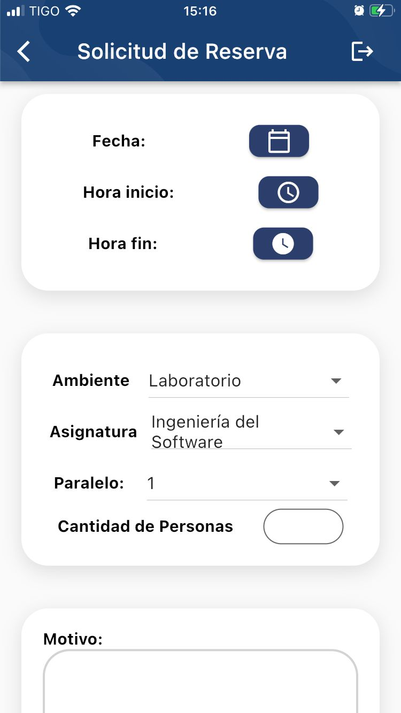 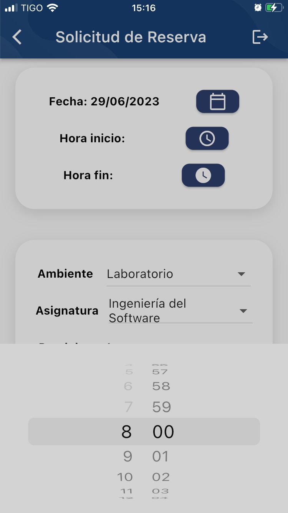
### Classroom Assignment
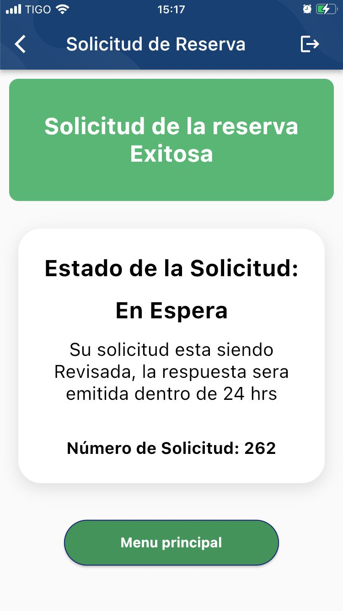 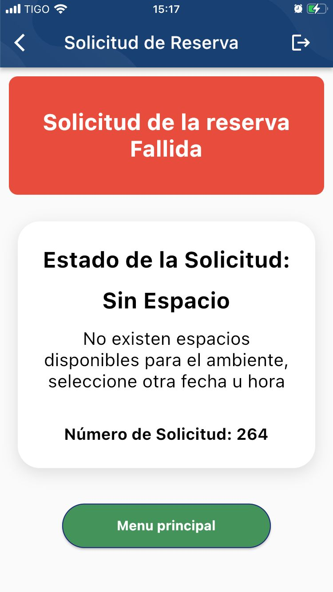 
### Pending Requests
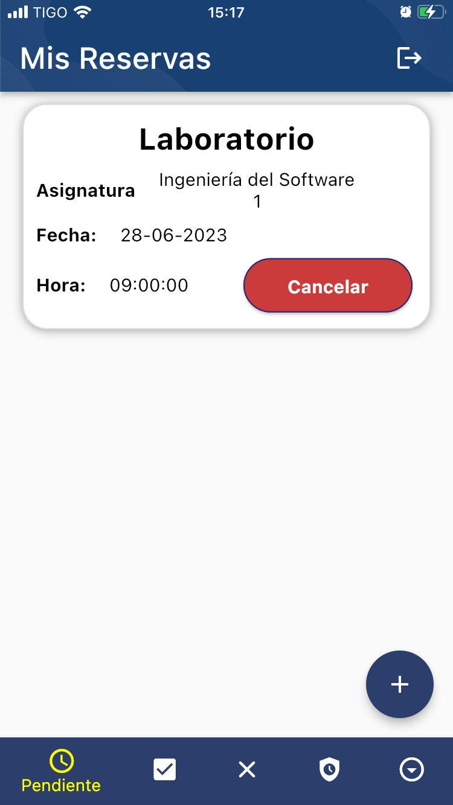
### Accepted Requests
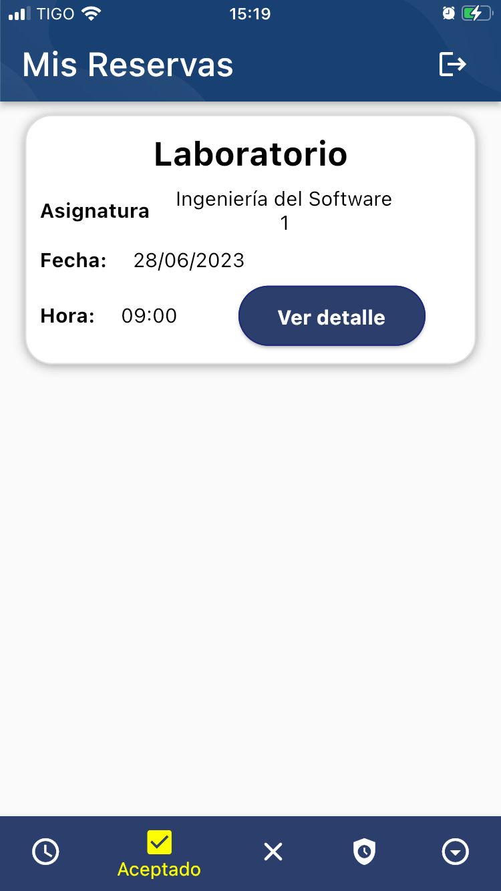 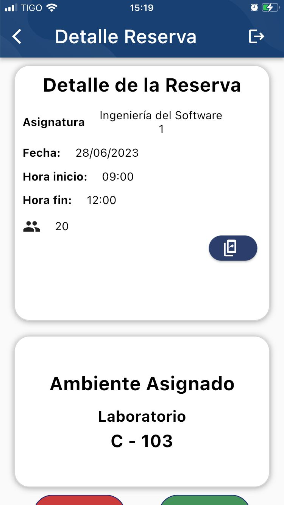 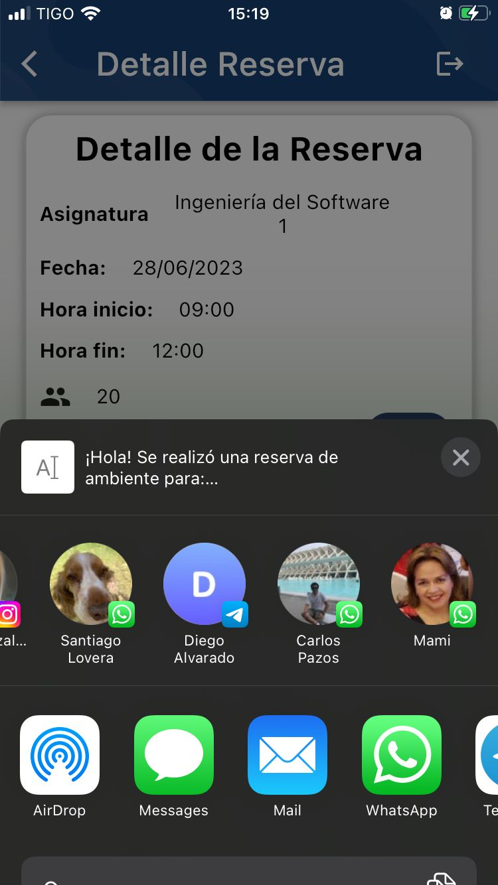
### Register Entrance
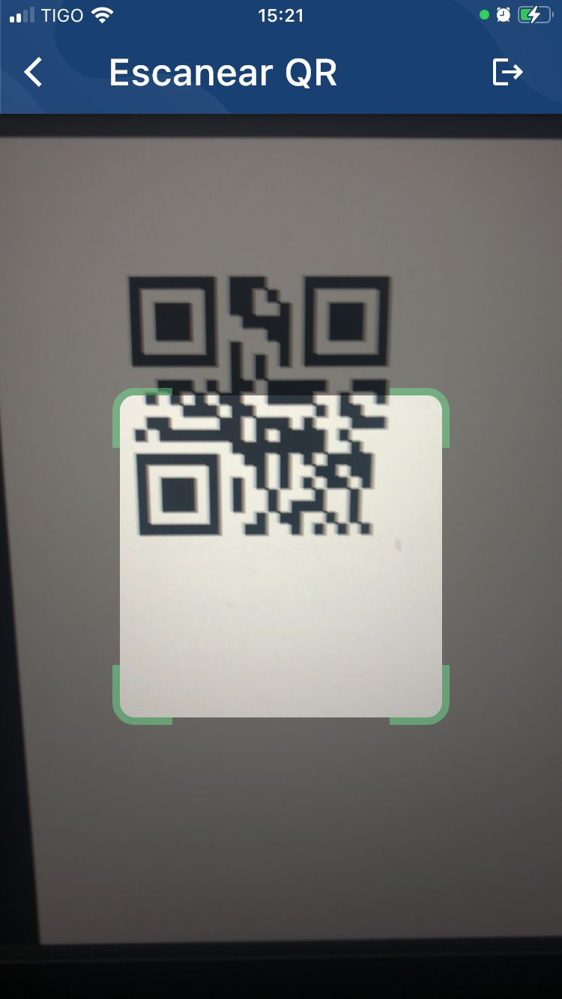 
### Finished Reservations
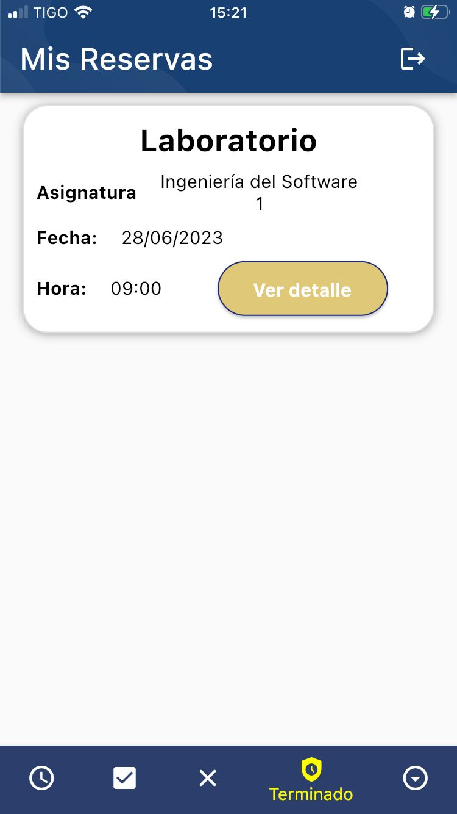 
### Register Claim
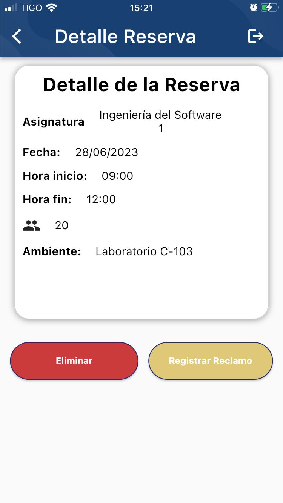 
### Pending Claims
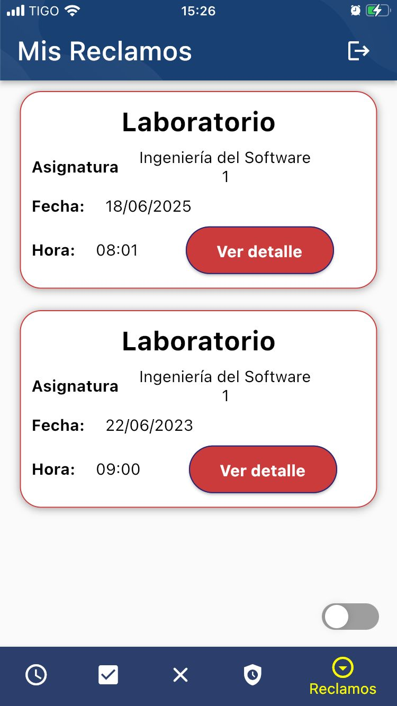 
### Attended Claims Information
This is a response from the administrator of the University.
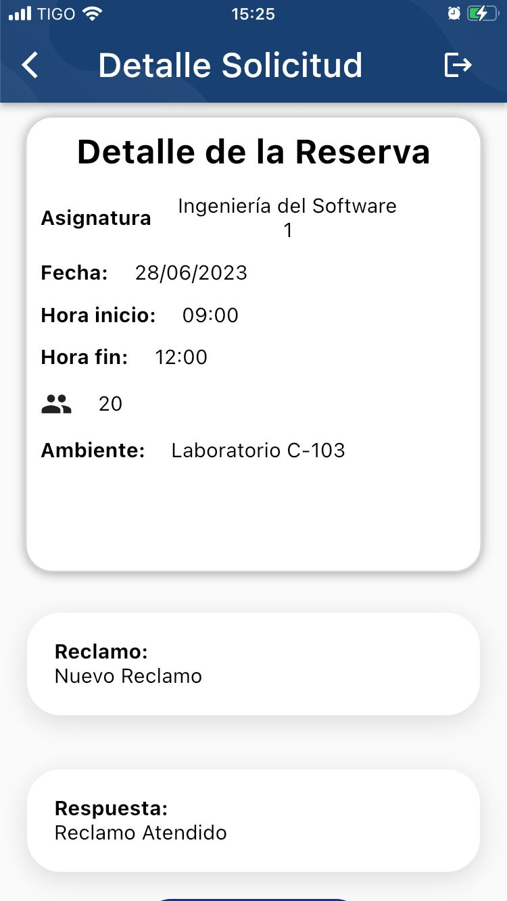 
## Admin Screens
### Professor´s Reservation Information

 ### Pending Claims
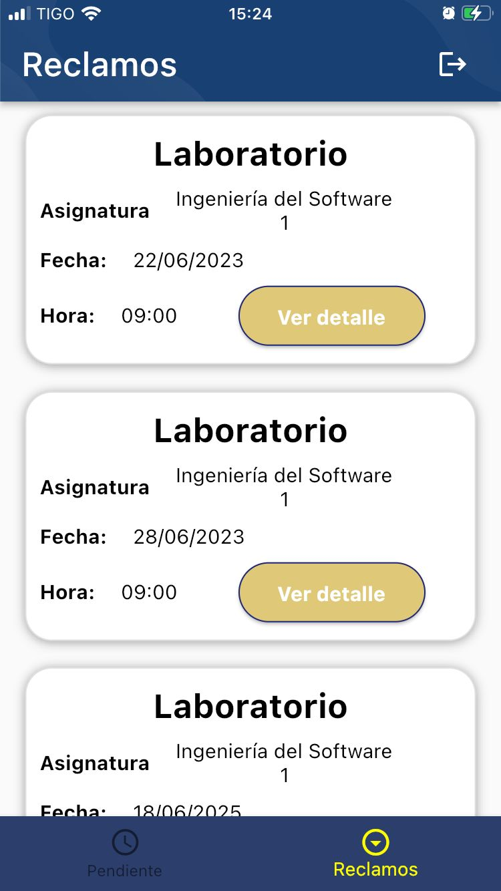

The admin can see the picture made by the proffessor
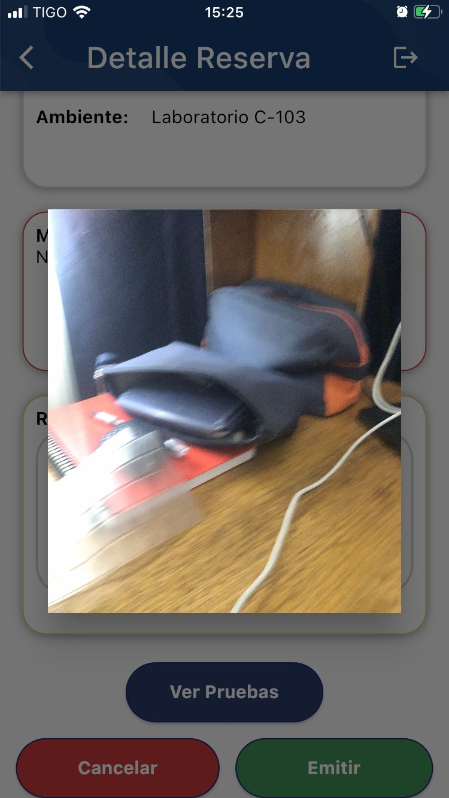

