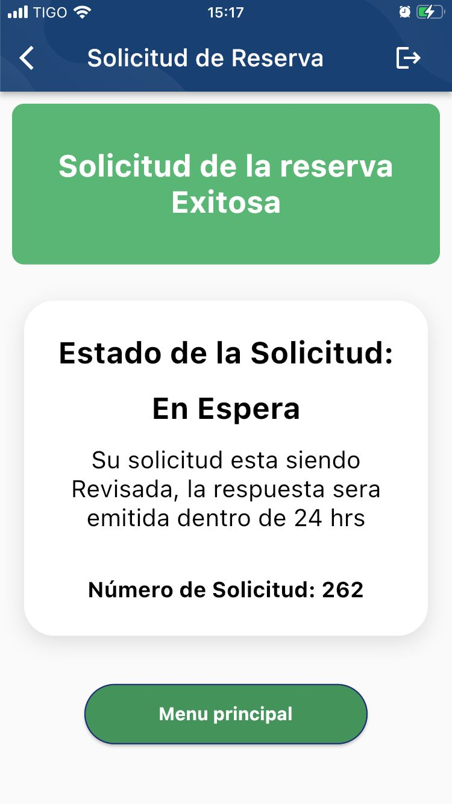
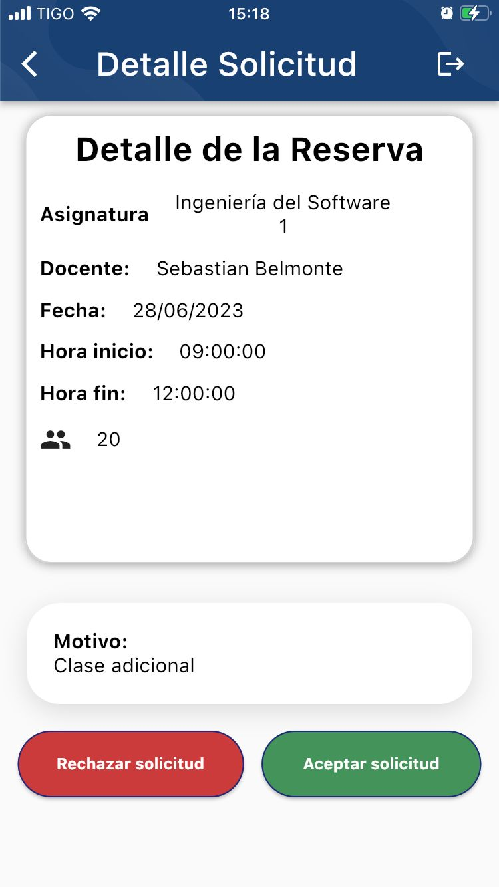

# Classroom Reservation System

This is a Flutter app with a Spring Boot backend that serves as a classroom reservation system for professors. The app automates the process of reserving classrooms for extra classes, allowing professors to easily request and manage reservations. It also includes features for administrators to review and handle reservations and claims.

## Features

- **Professor Interface**: Professors can log in to the app and access various screens to manage their reservations and claims.
- **Classroom Reservation**: Professors can request a reservation for a specific environment or classroom through the app.
- **Automatic Assignment**: The app automatically assigns a classroom to the professor based on their reservation request.
- **QR Code Entrance**: Professors can register their entrance to the assigned classroom by scanning a QR code.
- **Claims Submission**: If professors encounter any issues with their reservation, they can submit a claim along with pictures of the classroom.
- **Administrator Interface**: Administrators can log in to the app and perform actions related to reservations and claims.
- **Reservation Approval**: Administrators can review and accept or decline reservation requests from professors.
- **Claims Handling**: Administrators can address claims by providing a response and reviewing the pictures submitted by professors.

## Repository Links

- [Spring Boot Backend Repository](https://github.com/SebastianBelmonte01/environment_ucb_backend)

## Screenshots

### Professor Screens

#### Login

#### Loading Screen

#### Initial Screen

#### Register a New Request

#### Classroom Assignment

#### Pending Requests

#### Accepted Requests

#### Register Entrance

#### Finished Reservations

#### Register Claim

#### Pending Claims

#### Attended Claims Information
This screenshot shows a response from the administrator of the University.

### Admin Screens

#### Professor's Reservation Information

#### Pending Claims

Feel free to explore the repository for more information about the app's implementation and usage.
